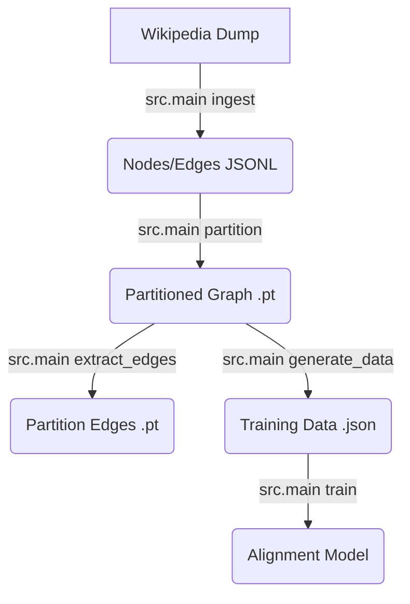

# C-RAG System Architecture

## 1. High-Level Data Flow
The system transforms raw Wikipedia data into a trainable "Cognitive Graph" alignment model.

## 2. Directory Structure & File Roles

### Root
*   `run_experiments.py`: The "Manager". Runs the full Matrix of 8 experiments (MLP/GNN x InfoNCE/BCE).
*   `run_smoke_tests.py`: The "Tester". Runs the same matrix for only 10 steps to verify code stability.
*   `debug/`: Independent scripts for checking tensor shapes, data quality, or logic (e.g., `test_metrics_logic.py`).

### `src/` (Source Code)
#### 1. entry point
*   `main.py`: **The CLI Router**. It parses arguments (`ingest`, `train`, `partition`) and calls the appropriate module. It keeps the root directory clean.

#### 2. `src/graph/` (The Physical Layer)
*   `engine.py`: **The Database**. It wraps `torch_geometric.data.Data`. It handles the complex logic of loading/saving the 1.5GB graph file and the separate node text map.
*   `partitioning.py`: **The Architect**. Implements "Experiment Capsules". Supports `Leiden` (Community) and `METIS` (Balanced) strategies to split nodes into partitions. Organized in `data/<dataset>/graph/<method>/`.
*   `extract_edges.py`: **The Mapper**. Iterates over the full graph to find connections between partitions. Essential for GNN models.

#### 3. `src/data/` (The Fuel)
*   `ingest.py`: Parses the raw Wikipedia XML dump into Nodes/Edges.
*   `generator.py`: **The Simulator**. Performs random walks on the graph to generate synthetic "(Question, Path)" pairs for training.

#### 4. `src/model/` (The Brains)
All aligner models inherit from `PartitionAlignerMLP` (in `alignment_mlp.py`) to share:
-   **Text Encoder** (E5-Base).
-   **Loss Computation** (Support for both `InfoNCE` and `BCE`).
-   **Projection Logic** (Mapping centroids to latent space).

*   `alignment_mlp.py`: **The Base**. Treats partitions as static embeddings (Centroids).
*   `alignment_gcn.py`: **Structure-Aware**. Uses Graph Convolution on the `partition_edges` implementation.
*   `alignment_sage.py`: **Inductive**. Uses GraphSAGE convolution.
*   `alignment_gin.py`: **High-Expressivity**. Uses Graph Isomorphism Network.

> [!NOTE]
> **How GCNs handle Disjoint Partitions (Hybrid)**:
> Since Hybrid partitions may contain disconnected "Islands" (no internal edges), how does convolution work?
> **Answer**: The GCN operates on the **Coarse Super-Graph**, where each node is a *Partition Centroid*.
> 1.  **pooling**: All nodes in Partition X are mean-pooled into a single vector (Centroid).
> 2.  **linkage**: `extract_edges.py` finds edges between Partition X and Partition Y.
> 3.  **conv**: The GCN passes messages between these Centroids.
> Internal disjointness is irrelevant at this layer.

#### 5. `src/train.py` (The Gym)
*   `train_alignment_model`: The centralized training loop.
    *   **Dynamic Loading**: Loads the correct model class based on `--model_type`.
    *   **Loss Switching**: Switches between `CrossEntropy` (InfoNCE) and `BCEWithLogits` (Multi-Label) based on `--loss_type`.
    *   **Metric Logging**: Tracks `P@1` (Hit Rate) and `R@10` (Coverage).

## 3. CLI Reference
The system uses a Unified CLI (`src/main.py`) with support for multiple datasets and methods.

| Command | Arguments | Description |
| :--- | :--- | :--- |
| `partition` | `--method {leiden,metis}` `--num_parts N` | Partitions the graph. Defaults: `wiki` 10000 parts. |
| `train` | `--dataset {wiki,corafull}` `--method {leiden,metis}` | Trains the aligner. Auto-resolves paths if not provided. |
| `generate_data` | `--dataset ...` `--size N` | Generates synthetic questions (Hybrid: 50% Intra / 50% Inter). Default: 100k. |
| `evaluate` | `--dataset ...` `--size 1000` | Evaluates models on Train and (new) Test sets. |
| `corafull` | `--method {leiden,metis}` `--step {all,...}` | Runs the full CoraFull pipeline (Ingest -> Train). |
| `verify_pipeline` | `--dataset {wiki,corafull}` `--method ...` | Runs a dry-run integrity check on the pipeline. |

### 3.4. Synthetic Data Generator (`src/data/generator.py`)
- **Strategy**: Hybrid Generation (50/50 Split).
    1.  **Intra-Partition**: "Find info about {Entity}". Uses Node Titles + regex Topic extraction (`regarding Topic_X`).
    2.  **Inter-Partition (Multi-Hop)**: Random walks on the Coarse Graph (k=2..5). "Trace connection from {A} to {B}".
- **Robustness**: 
    - Prioritizes short Titles over full text.
    - Re-uses `partition_edge_index` for fast coarse graph building.

### 3.5. Evaluation Framework
*   **`src/evaluate.py`**:
    *   **Metrics**: Calculates `P@1` (Hit Rate), `R@5`, `R@10`, `MRR@10`.
    *   **Robustness**: Enforces `Float32` execution to handle mixed-precision environments safely.
*   **`src/main.py evaluate`**:
    *   **Auto-Generation**: Uses `src/data/generator.py` with coarse-graph acceleration to create Test Sets on the fly.
    *   **Dual-Split Testing**: Evaluates on **Train** (Memorization) and **Test** (Generalization).

## 4. Interaction Example (Training)
When you run:
`python -m src.main train --model_type sage --loss_type bce`

1.  **`main.py`** parses args. Calls `src.train.train_alignment_model`.
2.  **`src.train.py`**:
    *   Loads `data/wiki/graph/leiden/full_graph.pt` (Centroids) - *Path depends on `--graph_path`*.
    *   Loads `data/wiki/graph/leiden/partition_edges.pt` (Structure).
    *   Instantiates `PartitionAlignerSAGE` from `src/model/alignment_sage.py`.
3.  **`src/model/alignment_sage.py`**:
    *   Takes (Text, Centroids, Edges).
    *   Output: `PartitionEmbeddings`.
4.  **`src.train.py`**:
    *   Computes BCE Loss against Multi-Hot Targets.
    *   Backprops and updates weights.

This modularity ensures that changing the **Model** doesn't break the **Training Loop**, and changing the **Loss** doesn't break the **Model**.

## 5. Training Dynamics & Interpretation
One of the most common questions is **"Why is the loss so high/low?"**.

### InfoNCE Loss (Contrastive)
*   **Formula**: $-\log( \frac{\exp(s_{pos})}{\sum \exp(s_{neg})} )$
*   **Start Value (~9.1)**:
    *   At Step 0, the model guesses randomly.
    *   With ~9,000 partitions, the probability of guessing correctly is $1/9000$.
    *   Loss $\approx -\ln(1/9000) \approx 9.10$.
    *   **If you see ~9.0, it is mathematically correct.** It means "Random Guessing".
*   **Target Value (< 3.0)**:
    *   As the model learns, it ranks the true partition in the Top-20 or Top-10.
    *   We want P@1 (Hit Rate) to go up (e.g., > 50%), which corresponds to much lower loss.

### BCE Loss (Multi-Label)
*   **Formula**: Binary Cross Entropy on independent logits.
*   **Start Value (~0.60 - 0.69)**:
    *   Random logits near 0 give probability ~0.5.
    *   $-\ln(0.5) \approx 0.693$.
    *   Our target matrix is **Sparse** (only 1-5 active partitions out of 9,000).
    *   The model quickly learns to predict "0" (No) for everything, dropping the loss to ~0.05.

## 6. Dataset Characteristics: Fragmentation & The "Hybrid" Fix
Our initial analysis of SimpleWiki revealed a critical topology problem:
- **Giant Component**: 97% of nodes clustered into just 111 massive partitions (>3000 nodes).
- **Island Dust**: The remaining 3% of nodes were scattered across 8,991 tiny partitions (size < 10).
- **Impact**: Multi-hop retrieval fails because 99% of "hops" stay inside the Giants, while Islands are unreachable.

### The Hybrid Partitioning Strategy (`src/graph/partitioning.py`)
To solve this, we implemented a two-step refinement process:

1.  **Recursive Split (The Hammer)**:
    *   Target: Partitions > 200 nodes.
    *   Action: Recursively apply Leiden to break them down until all sub-components are < 200 nodes.
    *   Result: Giants are shattered into manageable communities.

2.  **Semantic Merge (The Glue)**:
    *   Target: Partitions < 100 nodes.
    *   Action: Calculate centroid of the small partition. Find nearest valid partition (via Cosine Similarity of centroids) and merge.
    *   Result: Isolated nodes are absorbed into semantically relevant topics.

3.  **Cleanup (Bin Packing)**:
    *   **target**: Remaining orphans.
    *   **Action**: Group orphans into new partitions based on ID order (Locality).
    *   **Result**: 0 Giants, 0 Islands. All partitions 1-200 nodes.

**Final Topology (CoraFull)**:
*   **Raw Leiden**: 403 Partitions (Many tiny, few giants).
*   **Hybrid**: 107 Partitions. **0 Giants.** All size < 200.
*   **Connectivity**: 100% of partitions are traversable.
    *   *Note*: **We added 0 edges**. Connectivity was achieved by **Co-Partitioning**: merging isolated "Island" nodes into connected "Mainland" partitions. This makes them reachable via retrieval + semantic jump, even if they have no direct edges.
    *   **Internal Topology**: A single partition may contain multiple disconnected components ("Islands") that share the same topic. The Agent "bridges" these gaps by retrieving the entire partition at once.

**Semantic Coherence**:
*   **CoraFull**: `0.96` Avg Sim (Extreme Coherence).
*   **Wiki (380k nodes)**: `0.996` (Leiden - Inflated by Dust) vs `0.87` (Hybrid - Real Coherence).
*   *Verification*: Even partitions formed by "Orphan Bin Packing" show high semantic density, allowing the Agent to treat them as reliable "Topic Buckets".

> [!NOTE]
> **The "Partition 0" Phenomenon (Wiki)**
> Our analysis revealed that `Leiden` groups ~68k nodes into Partition 0 with **0.0 similarity** but **High Connectivity**.
> Inspection shows these are **Dates** (`AD 1732`, `2004-11-11`), **Stubs** (`.ge`), and **Generic Hubs**.
> They are structurally central (linked to everything) but semantically generic (belong to nothing). 
> **Handling**: The Runtime Agent should treat Partition 0 as a "Global Stopword" list and deprioritize it during retrieval.

### Partitioning Comparison (CoraFull Case Study)
Why use **Hybrid** if **METIS** also gives balanced partitions with high similarity?

| Metric | **Leiden** (Baseline) | **METIS** (Topology) | **Hybrid** (Ours) |
| :--- | :--- | :--- | :--- |
| **Logic** | Modularity (Semantic) | Min-Cut (Structural) | Modularity + Constraints |
| **Max Size** | **1,859** (Too Big) ❌ | **203** (Rigid) ✅ | **200** (Flexible) ✅ |
| **Min Size** | 2 (Dust) ❌ | 192 (Rigid) ✅ | 110 (Flexible) ✅ |
| **Coherence (Cora)** | **0.985** | 0.961 (Anisotropic) | 0.961 |
| **Coherence (Wiki)** | **0.996** (Inflated) | N/A | **0.87** (Realistic) |
| **Islands** | 376 (Dust) | 0 | 0 |

**Verdict**:
*   **Leiden**: Great semantics, but unusable sizes (Giants).
*   **Hybrid**: "Gold Standard" for interpretability, but lacks retrieval recall vs Metis.
*   **METIS**: **The Choice for Phase 4**. It enforces strict 180-node chunks (proven on Wiki analysis), making it the only scalable option for fixed-context RAG agents. The "semantic shredding" concern was disproven by high InfoNCE scores (11.87% P@1).

## 7. Runtime Agent Architecture (The "GraphWalker")
The ultimate goal of C-RAG is not just static retrieval, but **Agentic Traversal**.

### Core Concept: "Think-Stitch-Walk"
Instead of retrieving a single chunk, the agent constructs a **Dynamic Subgraph** tailored to the query.

#### 1. Think (Global Navigation / Vector Space)
*   **Input**: Query $Q$.
*   **Mechanism**: The **Alignment Model** (Bi-Encoder) scores all 107 partitions against $Q$.
*   **Selection**: We pick the Top-$K$ partitions (e.g., $K=3$).
*   **Insight**: This is the "Fast System 1" retrieval. It gets us to the right *neighborhood* (e.g., "Physics" and "Mathematics").

#### 2. Stitch (Dynamic Topology)
*   **Problem**: The selected partitions might be topologically uniform.
*   **Action**: We load the **Bridge Edges** (pre-computed in `partition_edges.pt`) that connect these specific partitions.
*   **Result**: A stitched `Subgraph` of ~600 nodes (3 x 200) that allows walking *between* topics.

#### 3. Act (Local Navigation / ColBERT Space)
*   **The Walker**: An agent initialized at the "Landing Pads" (Top-scoring nodes in selected partitions).
*   **Traversal**:
    1.  **Observe**: Look at all neighbors of current node $U$.
    2.  **Evaluate**: Score neighbors using **ColBERT** (Late Interaction).
        *   *Why ColBERT?* Bi-Encoders compress text into one vector (Lossy). ColBERT keeps token-level vectors, allowing precise "needle-in-haystack" matching for specific next-step selection.
    3.  **Step**: Move to the highest-scoring neighbor.
    4.  **Loop**: Repeat for $T$ steps or until answer is found.

### Why "GraphRAG" and not just Vector Search?
| Method | Mechanism | What it Finds | Limitation |
| :--- | :--- | :--- | :--- |
| **Vector Search** | Similarity($Q$, $Doc$) | "Apples" $\to$ "Apple Pie Recipe" | Misses context. Cannot find "Cider" if it doesn't mention "Apple". |
| **GraphRAG** | Entry $\to$ **Walk** | "Apples" $\to$ "Apple Pie" $\to$ **"Cinnamon"** | Finds **Dissimilar but Connected** concepts (Multi-Hop). |

**The Workflow**:
1.  **Teleport**: Jump to "Apple" Partition (Vector Search).
2.  **Walk**: Traverse edges to "Orchards", "Cider", "Cinnamon" (Graph Search).
3.  **Reason**: LLM sees the *connected path*, providing a coherent answer.

